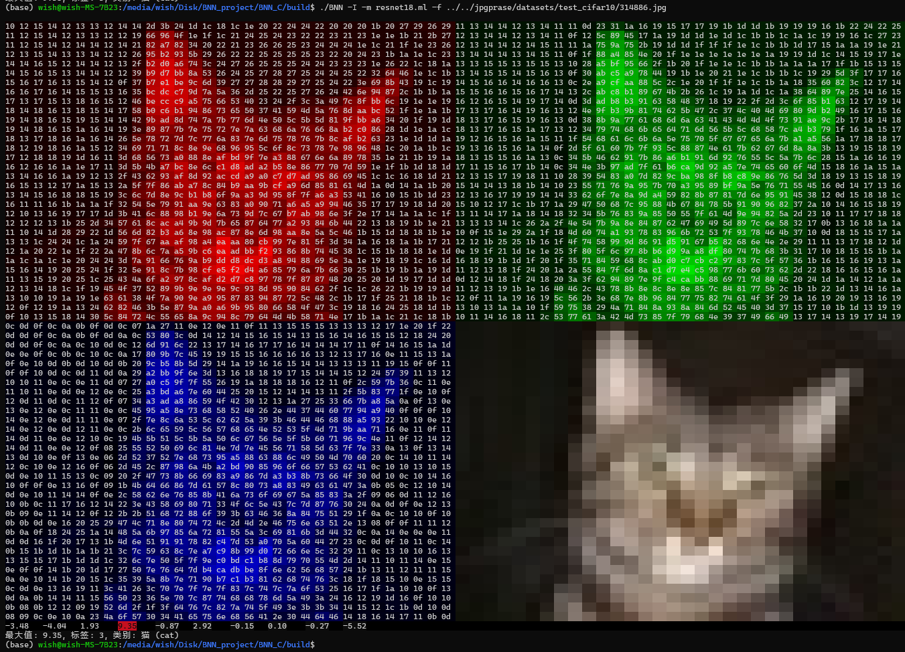

# BNN_C

## Description
This code repository is an implementation of BNN inference framework based on C language.
## usage
#### 1.clone this repository
```
git clone https://github.com/soul0229/BNN_C.git
```
#### 2. create build directory
```
sudo apt update
sudo apt install cmake build-essential gcc libcjson-dev libjpeg-dev -y 
cd BNN_C && mkdir build
export BNN_C_PATH=$(pwd)
cd build
```
#### 3. init cmake project
```
cmake ..
```
#### 4. make this project
```
make
```
## run
#### 1. trans model.th to json file
```
cd $BNN_C_PATH/tools
python model_to_json.py
```
#### 2. parse the net model
```
cd $BNN_C_PATH/build
./BNN -P -f $BNN_C_PATH/model.json
```
Output is as follows:
```
|---resnet18.ml
|       |--- conv1
|       |---  bn1
|       |--- layer1
|       |       |---   0
|       |       |       |--- conv1
|       |       |       |---  bn1
|       |       |       |--- conv2
|       |       |       |---  bn2
|       |       |---   1
|       |       |       |--- conv1
|       |       |       |---  bn1
|       |       |       |--- conv2
|       |       |       |---  bn2
|       |--- layer2
|       |       |---   0
|       |       |       |--- conv1
|       |       |       |---  bn1
|       |       |       |--- conv2
|       |       |       |---  bn2
|       |       |       |---shortcut
|       |       |       |       |---   0
|       |       |       |       |---   1
|       |       |---   1
|       |       |       |--- conv1
|       |       |       |---  bn1
|       |       |       |--- conv2
|       |       |       |---  bn2
|       |--- layer3
|       |       |---   0
|       |       |       |--- conv1
|       |       |       |---  bn1
|       |       |       |--- conv2
|       |       |       |---  bn2
|       |       |       |---shortcut
|       |       |       |       |---   0
|       |       |       |       |---   1
|       |       |---   1
|       |       |       |--- conv1
|       |       |       |---  bn1
|       |       |       |--- conv2
|       |       |       |---  bn2
|       |--- layer4
|       |       |---   0
|       |       |       |--- conv1
|       |       |       |---  bn1
|       |       |       |--- conv2
|       |       |       |---  bn2
|       |       |       |---shortcut
|       |       |       |       |---   0
|       |       |       |       |---   1
|       |       |---   1
|       |       |       |--- conv1
|       |       |       |---  bn1
|       |       |       |--- conv2
|       |       |       |---  bn2
|       |---  bn2
|       |--- linear
```
#### Convert the CIFAR10 dataset to jpg
```
cd $BNN_C_PATH/tools
python trans_cifar10_to_jpg.py --dataset <your cifar10 dataset path>
```

## test result
```
cd $BNN_C_PATH/build
./BNN - I -m resnet18.ml -f <cifar10 test dataset jpg path>
```


## License
All code except drivers in GPLDriver directory are licensed under BSD 2-Clause. GPL Drivers are licensed under GPLv2 license.